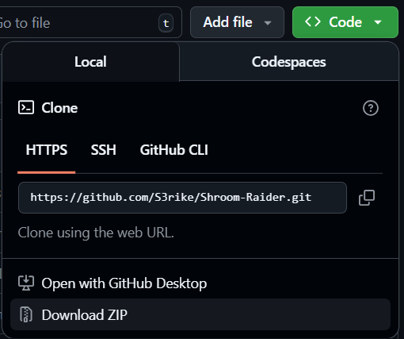

<h1 align="center">

</h1>
<p align="center">
<i>Immortality isn't free, the forest holds the key.</i>
</p>

<p align="justify">
<i>Being mortal is boring!</i> You are <b>Laro Craft</b> an experienced adventurer that longs to experience a taste of immortality. According to the legends, there exists a special mushroom in the <b>Forest of Ei</b> that grants a person immortal life. However, the journey you will face won't be easy. You will have to collect as many mushrooms as you can using the items you can see in the wild. Are you willing to take on this <b>quest to eternity</b>?
</p>

## 📒 Table of Contents
- [💾 Installation Guide](#-installation-guide)
  - [▶️ Install from Source](#️-install-from-source)
  - [⬇️ Installing Dependencies](#️-installing-dependencies)
  - [🎮 Starting the Game](#-starting-the-game)
- [📖 User Manual](#-user-manual)
  - [🎯 Objective](#-objective)
  - [🏃‍♂️ Movement System](#️-movement-system)
- [⚙️ Mechanics](#️-mechanics)
  - [⛏️ Tiles and Items](#️-tiles-and-items)
  - [🔍 Demonstration](#-demonstration)
- [👾 Bonus Features](#-bonus-features)
- [📁 Code Structure](#-code-structure)
- [🧪 Unit Testing](#-unit-testing)

## 💾 Installation Guide

> ### Lengthy Guide Up Ahead
>As you scroll through this guide, you may feel somewhat lazy to read all of them due to amount of options that we have laid down. For the sake of simplicity, we will put the options that are understandable in layman's terms in `Option 1` and put the more technical stuff (for installation) on the other options.

### ▶️ Install from Source
Let's get started! To install the game, there are two ways on how to do it:

**Option 1: Download Zip**

Clicking this [link](https://github.com/S3rike/Shroom-Raider/archive/refs/heads/main.zip) will automatically download the zip file of the repo. You may also opt to download the it in Github by clicking on `<> Code` which can found on the right corner and click on `Download Zip`.

<p align="center">

</p>

**Option 2: Clone the Repository**

***Note:*** This option is possible if and only if you have Git installed. For more information on how to git started ~~(pun intended)~~, check out this [link](https://github.com/git-guides/install-git) from Github.

```bash
git clone https://github.com/S3rike/Shroom-Raider.git
```

### ⬇️ Installing Dependencies
To install the required dependencies, open your terminal and navigate to the directory where **Shroom Raider** is located

```bash
cd shroom-raider
```

You're so close to installing the game! However, your game is missing some content and you need to install them. You have two options on how to do so:

**Option 1: Quick Installation**

Just run the following command on your terminal, make sure that you are in the directory where Shroom Raider is located

```bash
python3 -m pip install -r requirements.txt
```

**Option 2: Creating a Virtual Environment**
> For more information on why you should use a virtual environment, feel free to check out this [link](https://stackoverflow.com/questions/41972261/what-is-a-virtualenv-and-why-should-i-use-one)!

Create the virtual environment
```bash
virtualenv .venv

# or
python3 -m venv .venv
```

Active .venv
```bash
# Linux
source .venv/bin/activate

# Windows
./.venv/bin/activate.ps1
```

Install dependencies
```bash
pip install -r requirements.txt
```
> Note that some modules may be need to be installed for Linux users.

### 🎮 Starting the Game
There are three ways on how you can start the game!

**Option 1: Run Game**

The first option allows you to run the main game and get familiar with how the game works. If this is you're **first time playing**, it is recommended you do this first!

```bash
python3 shroom_raider.py

# or
python3 -m shroom_raider
```

**Option 2: Play Specific Map**

The second option allows you to **choose a map** from `maps/` and play that particular map!

```bash
python3 shroom_raider.py -f <stage_file>

# or
python3 -m shroom_raider -f <stage_file>
```

Example:

```bash
python3 shroom_raider.py -f "maps/map1.txt"
```

**Option 3: Automate the Game**

If you like to **premove**, then this option is for you! This option allows you to pick a particular map and play the game using a string of moves and view the final state of the game in another file (you get to name your output file).

```bash
python3 shroom_raider.py -f <stage_file> -m <string_of_moves> -o <output_file>

# or
python3 -m shroom_raider -f <stage_file> -m <string_of_moves> -o <output_file>
```

Example:

```bash
python3 shroom_raider.py -f "maps/map1.txt" -m "WASD" -o "output.txt"
```

## 📖 User Manual
This tutorial aims to guide new players on the mechanics of **Shroom Raider**. If you have played this game before, feel free to skip this part!

### 🎯 Objective
**The Forest of Ei has no beginning and has no end.** It is a place between the living and the dead. Once you set foot, there's no turning back. The mushrooms that promise immortality thrive in this place, thanks to the souls that never found their way back. Gather **sixty-seven mushrooms** and immortality shall be yours. 

Or, if can no longer bear the pains the forest brings, the **Pond of Lethe** awaits you. Stare into your reflection, and the gods will help you forget your pain. Death is not a lovely ending, nor is it a sorrowful beginning. It is *nostalgic*.
> *Nostalgia* comes from the Greek words *nostos* (homecoming) and *algos* (pain). *Your psyche aches to return to their home.*


### 🏃‍♂️ Movement System
Shown below is the list of possible moves that a user can do and their corresponding keybinds. Do note that the **keybinds are case-insensitive** (lowercase and uppercase does the same move)!

| Keybind    | Action        | 
| :--------: | ------------- |
| W          | Move up       |
| A          | Move left     |
| S          | Move down     |
| D          | Move right    |
| P          | Pick up item  |
| !          | Reset stage   |
| Q          | Quit game     |

## ⚙️ Mechanics
### ⛏️ Tiles and Items
Shown below are the list of tiles and items that you may encounter in the forest alongside their descriptions.

| UI Symbol   | ASCII  | Name              | Description                                            |
|:----------: |:------:|------------------ |------------------------------------------------------- |
| 🧑         | L      | **Laro Craft**     | It's you! The one seeking immortality!                 |
| '　'        | .      | **Empty Tile**    | You can move to empty tiles.                           |
| 🌲         | T      | **Tree**          | You can cut down or burn these obstacles.              |
| 🍄         | +      | **Mushroom**      | Collect these to become immortal!                      |
| 🪨         | R      | **Rock**          | Can be pushed into empty tiles, paved tiles, or water. |
| 🟦         | ~      | **Water**         | A place for reflection or to forget your memories.     |
| ⬜         | -      | **Paved Tile**    | Formed when a rock is pushed into the water.           |
| 🪓         | x      | **Axe**           | Used to cut down trees (single use).                   |
| 🔥         | *      | **Flamethrower**  | Burns adjacent trees (single use).                     |

### 🔍 Demonstration
Shown below are some videos on how each item works! 

**🪓 Using an Axe**

An axe allows you to cut down a tree that you can see in your way! Just move to the direction of the tree and it shall disappear. However, do note that this is a **single-use** item, so use it wisely!

https://github.com/user-attachments/assets/af3a4392-8d2d-4512-90ad-0d50f0ac465f

**🔥 Using a Flamethrower**

If you've encountered this item, be careful to not burn your hands! This item allows you to burn down adjacent (those that share a common vertex) trees. This is also a **single-use** item, so be careful not to waste this!

https://github.com/user-attachments/assets/0a18b67c-18d9-4884-a941-688cf96321e6


## 👾 Bonus Features
For more information regarding the additional features, check the bonus features branch!


## 📁 Code Structure

The project is organised into three main files:
- shroom_raider.py - Contains the Game class and the main game logic
- auxilliary_functions.py - Contains helper functions for gameplay mechanics, display, and other system operations
- assets folder - Contains game assets such as tile definitions


Here is a **visual rendition** of the file structure!
```bash
├───assets
│   └───__pycache__
│   └───icons
│   └───images
│   └───final_state.py
│   └───tile_tags.py
├───maps
│   └───tutorial
│       ├───items
│       └───tiles
│   └───various maps here
└───pytest_stuff
│   └───__pycache__
│   └───icons
│   └───images
│   └───final_state.py
│   └───tile_tags.py
└───auxilliary_functions.py
└───README.md
└───requirements.txt
└───shroom_raider.py
```

## 🧪 Unit Testing

Current unit tests check for:
- Actually winning!
- Walking into walls
- Walking into water
- Pushing boulders into valid spaces
- Pushing boulders into trees, or other boulders
- Usage of axe and flamethrowers
- Trying to pick up an item multiple times, or picking up an item while already holding one

This accounts for all possible game_states that a player is likely to encounter (all movement types, winning/losing states, trying to walk or move objects that cannot be moved, and properly accounting for item usage and tracking)


<!-- ## 👥 About Us
**Developed by:**
* Camiña, Jeffrey 
* Oh, Enzo
* Soliva, Edgar -->
